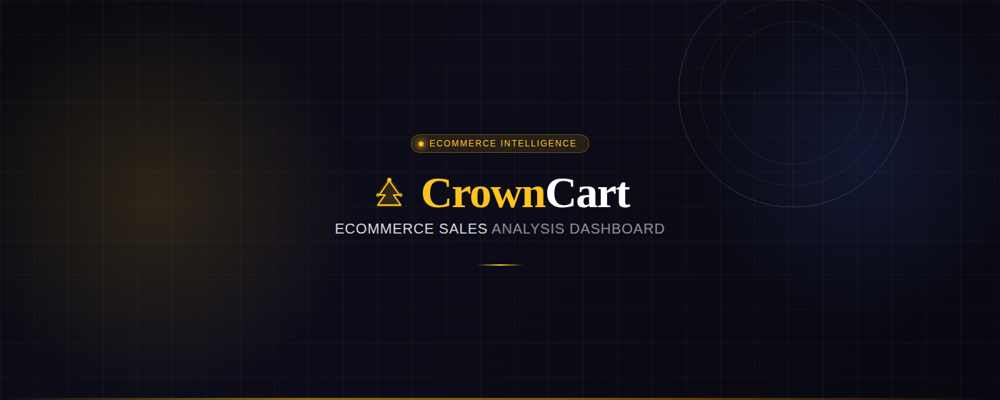
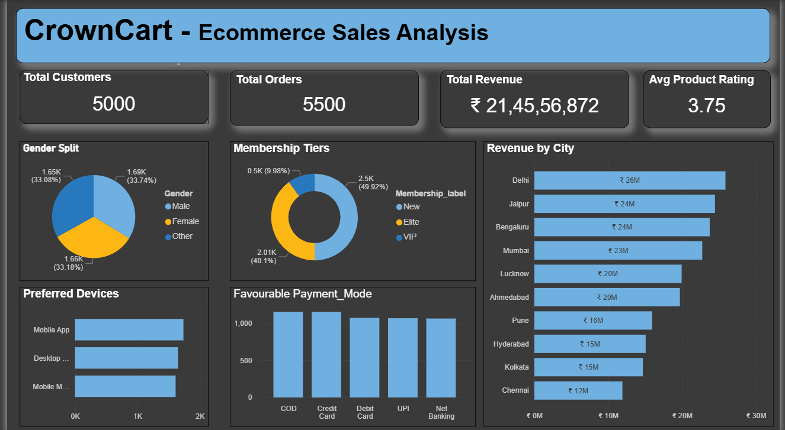
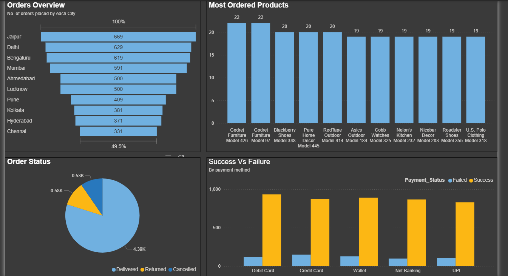
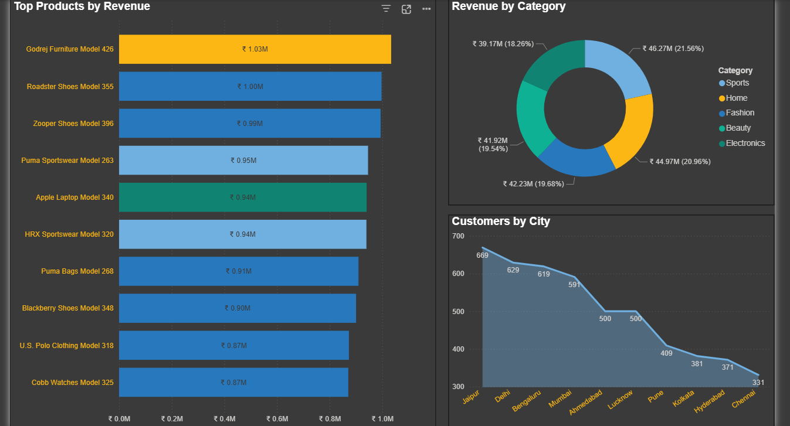

<div align="center">



# 🛒 CrownCart — Ecommerce Sales Analysis

**A full-stack data analytics project covering data engineering, SQL-based business intelligence, and executive-level Power BI reporting for a simulated Indian e-commerce platform.**

<br>


</div>

---

## 📋 Table of Contents

1. [Problem Statement](#-problem-statement)
2. [Project Overview & Objectives](#-project-overview--objectives)
3. [Tools & Technologies](#-tools--technologies)
4. [Dataset](#-dataset)
5. [Project Workflow](#-project-workflow)
6. [Dashboard Preview](#-dashboard-preview)
7. [KPIs](#-kpis)
8. [Key Insights](#-key-insights)
9. [SQL Analysis](#-sql-analysis)
10. [Repository Structure](#-repository-structure)
11. [Getting Started](#-getting-started)
12. [Author](#-author)

---

## 🎯 Problem Statement

E-commerce businesses generate massive volumes of transactional data every day — but raw data alone doesn't drive decisions. **The real challenge is transforming thousands of records into clear, actionable intelligence.**

CrownCart, a growing Indian e-commerce platform, needed answers to critical business questions:

- Where is revenue coming from — and where is it leaking?
- Which products and cities are the highest performers?
- What is the true order fulfillment health of the platform?
- How do customers prefer to pay, and which modes are most reliable?
- Are loyalty and membership programs delivering value?

This project was built to answer exactly those questions — end to end, from raw data to executive dashboard.

---

## 📌 Project Overview & Objectives

This is an **end-to-end Business Intelligence project** that simulates a real-world data analytics pipeline across four stages: **Data Cleaning → SQL Analysis → Visualization → Insight Generation**.

### Objectives

| # | Objective |
|---|-----------|
| 1 | Clean and structure raw multi-table e-commerce data for analysis |
| 2 | Build a normalized relational database in SQL Server |
| 3 | Write analytical SQL queries to compute business KPIs |
| 4 | Design an interactive 3-page Power BI dashboard for stakeholders |
| 5 | Extract and communicate actionable business insights |

---

## 🛠 Tools & Technologies

| Tool | Role in Project |
|------|----------------|
| **Microsoft Excel (Advanced)** | Data ingestion, cleaning, deduplication, formatting, pivot-based EDA |
| **SQL Server 2019 + SSMS** | Relational database creation, T-SQL querying, KPI computation, multi-table joins |
| **Power BI Desktop** | Data modelling, DAX measures, interactive 3-page dashboard |

---

## 📂 Dataset

> 📦 **Kaggle:** [Project_Ecom_Dataset by Aakash Sharma](https://www.kaggle.com/datasets/aakasharma21/project-ecom-dataset)

The dataset is structured as **4 relational tables** with **16,000+ total records**, modelling a real-world e-commerce database schema.

<details>
<summary><b>📄 Table 1 — Customers (5,000 records)</b></summary>

| Column | Description |
|--------|-------------|
| `Customer_ID` | Primary key |
| `Name`, `Gender`, `Age`, `DOB` | Customer demographics |
| `City`, `State`, `Country`, `Pincode` | Location data |
| `Membership_label` | New / Elite / VIP tier |
| `Loyalty_Points` | Reward points balance |
| `Preferred_Device` | Mobile App / Desktop Site |
| `Registration_Date` | Account creation date |

</details>

<details>
<summary><b>📄 Table 2 — Products (500 records)</b></summary>

| Column | Description |
|--------|-------------|
| `Product_ID`, `SKU` | Product identifiers |
| `Category`, `Sub_Category`, `Brand` | Classification |
| `Cost_Price`, `Selling_Price` | Pricing |
| `Profit_Margin`, `Discount` | Financial metrics |
| `Stock_Quantity`, `Reorder_Level` | Inventory |
| `Product_Rating`, `Product_Status` | Quality & availability |

</details>

<details>
<summary><b>📄 Table 3 — Orders (5,500 records)</b></summary>

| Column | Description |
|--------|-------------|
| `Order_ID`, `Order_Date` | Order identifiers |
| `Customer_ID`, `Product_ID` | Foreign keys |
| `Quantity`, `Unit_Price` | Volume & pricing |
| `Discount_Amount`, `Tax_Amount`, `Shipping_Charge` | Cost breakdown |
| `Payment_Mode` | COD / UPI / Card / Net Banking |
| `Order_Status` | Delivered / Returned / Cancelled |
| `Total_Amount` | Final order value (INR) |

</details>

<details>
<summary><b>📄 Table 4 — Payments (5,500 records)</b></summary>

| Column | Description |
|--------|-------------|
| `Payment_ID`, `Order_ID` | Identifiers |
| `Payment_Mode`, `Payment_Status` | Method & success/failure |
| `Transaction_Fee` | Gateway charges |
| `Refund_Amount`, `Refund_Date` | Refund tracking |

</details>

---

## 🔄 Project Workflow

```
┌─────────────────────────────────────────────────────────────────┐
│                        RAW DATA (Excel)                         │
│              4 Sheets · 16,000+ Records · Multi-table           │
└───────────────────────────┬─────────────────────────────────────┘
                            │
                            ▼
┌─────────────────────────────────────────────────────────────────┐
│                  STAGE 1 — DATA CLEANING (Excel)                │
│  • Remove duplicates & null values                              │
│  • Standardise column names & data types                        │
│  • Format dates, currency, and categorical fields               │
│  • Preliminary pivot tables for sanity checks                   │
└───────────────────────────┬─────────────────────────────────────┘
                            │
                            ▼
┌─────────────────────────────────────────────────────────────────┐
│               STAGE 2 — SQL ANALYSIS (SQL Server)               │
│  • Import tables into relational database (Crown_Cart DB)       │
│  • Write analytical queries across 4 domains:                   │
│    Customers · Orders · Products · Payments                     │
│  • Compute KPIs: Revenue, Delivery %, Top Products, etc.        │
│  • Multi-table JOINs for city-level revenue & order analysis    │
└───────────────────────────┬─────────────────────────────────────┘
                            │
                            ▼
┌─────────────────────────────────────────────────────────────────┐
│             STAGE 3 — VISUALIZATION (Power BI)                  │
│  • Connect Power BI to SQL Server / Excel source                │
│  • Build data model with table relationships                    │
│  • Create DAX measures for dynamic KPIs                         │
│  • Design 3-page interactive dashboard with slicers             │
└───────────────────────────┬─────────────────────────────────────┘
                            │
                            ▼
┌─────────────────────────────────────────────────────────────────┐
│              STAGE 4 — INSIGHTS & REPORTING                     │
│  • Extract 10+ business insights from visualizations            │
│  • Identify revenue drivers, churn signals & growth levers      │
└─────────────────────────────────────────────────────────────────┘
```

---

## 📊 Dashboard Preview

### Page 1 — Sales Overview
> KPI cards · Gender split · Membership tiers · Device preferences · Payment modes · Revenue by city



---

### Page 2 — Orders & Payments Intelligence
> Orders by city · Top 10 most ordered products · Order status breakdown · Payment success vs failure analysis



---

### Page 3 — Product & Revenue Deep Dive
> Top 10 products by revenue · Revenue by category · Customers by city distribution



---

## 📈 KPIs

<div align="center">

| KPI | Value |
|-----|-------|
| 👥 Total Customers | **5,000** |
| 📦 Total Orders | **5,500** |
| 💰 Total Revenue | **₹ 2,14,55,6,872** |
| ⭐ Avg Product Rating | **3.75 / 5** |
| ✅ Order Delivery Rate | **~79.8%** |
| 🔄 Return Rate | **~10.5%** |
| ❌ Cancellation Rate | **~9.6%** |
| 🏙️ Top Revenue City | **Delhi (~₹26M)** |
| 🏆 Top Revenue Product | **Godrej Furniture Model 426 (₹1.03M)** |
| 🛍️ Top Revenue Category | **Sports (21.56%)** |

</div>

---

## 💡 Key Insights

#### 🏙️ Geographic Performance
- **Jaipur leads in order volume** (669 orders) but **Delhi leads in revenue** (~₹26M) — indicating higher average order values in Delhi despite fewer orders
- Bengaluru and Jaipur closely follow at ~₹24M each, making the top 3 cities account for ~35% of total revenue
- **Chennai is the lowest performer** in both orders (331) and revenue (~₹12M) — a potential untapped market

#### 📦 Order Fulfillment Health
- With a **~79.8% delivery rate**, nearly 1 in 5 orders is either returned or cancelled — a significant operational risk
- Combined **return + cancellation rate of ~20%** suggests possible issues with product quality, delivery experience, or customer expectations
- Addressing return/cancellation rates could unlock **₹40M+ in recovered revenue**

#### 🛍️ Product Intelligence
- **Godrej Furniture** dominates both order volume (2 SKUs in top 10) and revenue (₹1.03M for Model 426)
- Top 10 products by revenue are spread across Furniture, Shoes, Sportswear, Electronics, and Watches — indicating healthy category diversification
- **Sports (21.56%) and Beauty (20.96%)** are near-equal top revenue categories, with all 5 categories within a 3% range — suggesting no single category dependency

#### 💳 Payment Behaviour
- **COD remains the most preferred payment mode** — a trust signal in the customer base, but operationally costly due to return risks
- Payment success rates are high across all digital modes (UPI, Net Banking, Credit/Debit Cards), with Debit Cards showing the highest failure count among digital methods
- Incentivising UPI/Wallet adoption could reduce COD dependency and improve cash flow

#### 👤 Customer Segmentation
- **~50% of customers are 'New' members** — strong acquisition, but the funnel to Elite/VIP needs strengthening
- With only ~10% VIP members, there is a significant **loyalty program growth opportunity**
- Gender distribution is nearly uniform (Male: 33.7%, Female: 33.2%, Other: 33.1%) — enabling gender-neutral marketing strategy
- **Mobile App is the dominant device** — mobile-first UX investments are well justified

---

## 🔍 SQL Analysis

The full analysis is in [`Project_Analysis.sql`](Project_Analysis.sql), structured across 4 analytical domains.

- **Customers** — Gender split, membership tiers, device preferences
- **Orders** — Delivery rate, revenue by city, top-selling products
- **Products** — Top rated, top discounted, revenue by category
- **Payments** — Preferred payment modes, success vs failure rates

---

## 📁 Repository Structure

```
CrownCart-Ecommerce-Analysis/
│
├── 📊 Ecommerce_Data.xlsx          # Raw dataset (4 sheets)
├── 🗄️  Project_Analysis.sql         # All SQL queries (4 analytical domains)
├── 📈 Report.pbix                   # Power BI interactive dashboard
│
├── 🖼️  crowncart_banner_2.png        # Project banner
├── 🖼️  Dashboard.png                 # Page 1 — Sales Overview
├── 🖼️  Dashboard2.png                # Page 2 — Orders & Payments
├── 🖼️  Dashboard3.png                # Page 3 — Product & Revenue
│
└── 📄 README.md                     # Project documentation
```

---

## 🚀 Getting Started

### Prerequisites
- Microsoft Excel 2016+
- SQL Server 2019+ with [SSMS](https://learn.microsoft.com/en-us/sql/ssms/download-sql-server-management-studio-ssms)
- [Power BI Desktop](https://powerbi.microsoft.com/en-us/desktop/) (free)

### Step 1 — Explore the Data
```
Open Ecommerce_Data.xlsx
Review all 4 sheets: Customers · Products · Orders · Payments
```

### Step 2 — Set Up the Database
```sql
-- In SSMS, create a new database
CREATE DATABASE Crown_Cart;
USE Crown_Cart;

-- Import each .csv file(attached dataset) as a table using:
-- SSMS → Right-click DB → Tasks → Import flat file
-- Source: Excel | Destination: SQL Server
-- Create 4 tables: Customers, Products, Orders, Payments
```

### Step 3 — Run SQL Analysis
```
Open Project_Analysis.sql in SSMS
Execute queries section by section to reproduce all KPIs and analysis
```

### Step 4 — Explore the Dashboard
```
Open Report.pbix in Power BI Desktop
Update data source path if prompted (point to local Excel or SQL Server)
Click Refresh → Explore all 3 dashboard pages
```

> 💡 **Dataset download:** [Kaggle — Project_Ecom_Dataset](https://www.kaggle.com/datasets/aakasharma21/project-ecom-dataset)

---

## 👨‍💻 Author

<div align="center">

### Aakash Sharma
**Certified Data Analyst**

<br>

[](https://www.linkedin.com/in/aakasharma21/)
[](https://www.kaggle.com/aakasharma21)
[](mailto:aakashs0101@gmail.com)

</div>

---

<div align="center">

⭐ **If this project helped you or gave you ideas, consider starring the repo!**

*Dataset is synthetic and built for portfolio & learning purposes.*

</div>
